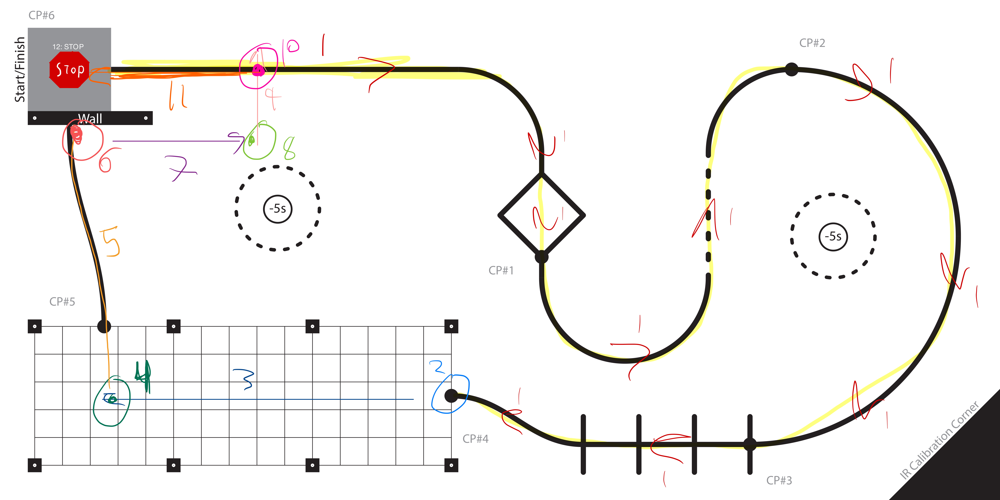

# Romi 
### Winter 2025
Project by Jake Borden and Ashford Connor 

**Table of contents:**
 - [Romi Design](#romi-design)
   - [Project Description](#project-description)
   - [Hardware Design](#hardware-design)
     - [Physical design](#physical-design)
     - [Bill of Materials](#bill-of-materials)
     - [Wiring Diagram](#wiring-diagram)
 - [Program Design and Structure](#program-design-and-structure)
   - [Tasks](#tasks)
   - [Classes](#classes)
 - [Discussion](#discussion)
 - [Video Demonstration](#video-demonstration)

## Project Description
The Romi robot is based on the ‘Romi’ chassis and motor kit from Pololu robotics. This platform includes a plastic chassis, power distribution board, 2 gearbox and motor combinations, two drive wheels and two caster wheels. Romi is capable of differential, forward and reverse driving, but is incapable of holonomic motion.  Other required hardware includes a pair of encoders, an STM 32L476RG Nucleo board and the proprietary Cal Poly made Shoe of Brian. This constructs a basic ground vehicle capable of driving until the 6 NiMh batteries lose charge, controllable using only encoder feedback. To perform more complicated functions within the scope of this project we added the following sensors and hardware: a 9DOF IMU, 8 x 13 IR reflectance sensor array, and voltage divider circuit. A summary table of all hardware and sensors used can be found below in Table 1.

The robot was tasked with completed the course shown below in Figure 3. There were several different approaches used to complete this course. What follows is our approach to solving this problem, complete with our successes, failures, insights and future steps for improving our Romi. 

###### Figure 1. Assembled Romi.

## Hardware Design
For its attempts to complete the course, Romi had the help of a number of sensors. First, an Adafruit BNO055 IMU was used to keep track of headings. This was connected to the Nucleo using I2C connection. Second, a pair of Pololu bump sensors were used for detecting the wall at the end of the course. Third, a Pololu analog IR reflectance sensor was used for line following. We purchased a sensor with a total of 13 channels, but only ended up using 7 of them for simplicity.

### Physical Design
CAD

### Bill of Materials
##### Table 1. BOM for Romi Project

| Item No. | Description               | Supplier             | Supplier PN    |
|---------|-----------------------|--------------------|----------------|
| 1       | Romi Chassis kit (pink) | Pololu              | 3501          |
| 2       | Encoder kit             | Pololu              | 3542          |
| 3       | 8 x 13 analog IR sensor array | Pololu              | 4253          |
| 4       | BN055 IMU and breakout board | Adafruit            | 2472          |
| 5       | STM 32L476RG Nucleo      | ST Microelectronics | STM32L476RG   |
| 6       | Shoe of Brian            | Cal Poly Mechanical Engineering | N/A           |
| 7       | Dupont connectors        | Amazon              | N/A           |
| 8       | 3.3k ohm resistors       | N/A                 | N/A           |
| 9       | Perfboard                | N/A                 | N/A           |
| 10      | 6 NiMh AA batteries      | Amazon              | N/A           |

### Wiring Diagram
A diagram showing the wiring connections between components.

## Program Design and Structure

###### Figure 3. Game track showing location of states. 

### Tasks

#### Sensor Task

The sensor task is responsible for reading sensor values and keeping track of significant milestones on the course. This task is functionally similar to a mastermind task, but it differs chiefly by its direct interaction with external hardware. Given the simple nature of checking course progress, it was appropriate to roll this function into the sensor task to improve memory consumption. This task is run with a priority of 2 and a period of 10 ms.

The task takes an encoder object, an IR sensor object, and an IMU object. It communicates with the motor task using three shares: the centroid share, the heading share, and the checkpoint share.

- The **centroid share** is used to share the value of the centroid as computed in the sensor task. The sensor task will only put values into this share and does not need to get them out.
- The **heading share** is used to share the value of the heading as computed in the sensor task. This will be shared as a -179-0-180 degree value, while the sensor task itself uses the raw 360-degree reading to determine the robot's true orientation. This is done because it is more useful to the PID controllers in the motor task. The sensor task will only put values into this share and does not need to get them out.
- The **checkpoint share** is used as a flag to tell the motor task that it has reached the end of its current state. When the sensor task determines that the state is finished, using sensor data, a 1 is placed in the checkpoint share. The sensor task will only put a value of 1 into this share and does not read the value.

There are **12 states** in the sensor task. The transitions are determined using either encoder positions or heading angles. When the sensor value falls within the specified range, the state is considered finished, and the sensor task signals the transition using the checkpoint share and setting its own internal state variable to the next state.

The initialization of this task is done inside a run-once `if` statement above the while loop of the main generator function. This looks for a global variable called `sensor_init`, which the main function sets to `True` before starting the scheduler. Once init functions are complete, `sensor_init` is set to `False` so that the init functions will not run again. A more elegant and Pythonic implementation of this code would be to implement the task as a class, where the init functions are performed automatically upon instantiation of a sensor task object.

##### State Descriptions

- **STATE_1**: Line following through the course until checkpoint #4. The sensor task computes the centroid from the IR line sensor and sends it to the motor task via the centroid share. This state also keeps track of the encoder position looking for an encoder reading of 112 to 113 radians. Once this value is reached, the state zeroes the encoder, sets `sensor_state` to `STATE_2`, and puts a 1 in the checkpoint share. Radians were used for the distance in this state, as they proved to be more consistent in testing than a setpoint in millimeters.

- **STATE_2**: Changing the heading of Romi at checkpoint #4. The state reads the raw angle heading, tests it against the desired heading of 180 degrees (with respect to the starting angle), computes the bi-directional angle, and puts it in the heading share. Once the raw angle falls within the desired range, the encoder will be zeroed, a 1 will be put in the checkpoint share, and `sensor_state` is set to `STATE_3`.

- **STATE_3**: Heading following. This state is identical to the previous state, except that the transition point is an encoder distance rather than an angle. This state runs between checkpoint #4 and the turning point at the end of the grid. Once the distance to the end of the grid is read by the encoder, the state will zero the encoder, put a 1 in the checkpoint share, and `sensor_state` is set to `STATE_4`.

- **STATE_4**: Identical to `STATE_2`, but with a different final setpoint. It is a turn-in-place state with the only output being the bi-directional heading. The final heading will be 90 degrees with respect to the starting angle. The state transition process is the same.

- **STATE_5**: Nearly identical to `STATE_1`, with the state output being the centroid for line following. The transition out of this state, however, is triggered by the bump sensor. Each pass through this state, the bump sensors' Booleans are checked to see if Romi has encountered the wall. If one of the Booleans is `True`, then the standard state transition will occur as it has in the other states so far.

- **STATE_6**: Identical to `STATE_2`, but with a different final setpoint. It is a turn-in-place state with the only output being the bi-directional heading. This state is used to turn in place in preparation to drive around the wall. The final heading will be 0 degrees with respect to the starting angle. The state transition process is the same.

- **STATE_7**: Identical to `STATE_3`, but with a different final setpoint. It is a heading-following state with the only output being the bi-directional heading. The heading will be 0 degrees with respect to the starting angle. The state transition process is the same and will be triggered by reaching the desired encoder distance in millimeters.

- **STATE_8**: Identical to `STATE_2`, but with a different final setpoint. It is a turn-in-place state with the only output being the bi-directional heading. The final heading will be 90 degrees with respect to the starting angle. This state is used to turn in place towards the line. The state transition process is the same.

- **STATE_9**: Identical to `STATE_3`, but with a different final setpoint. It is a heading-following state with the only output being the bi-directional heading. The heading will be 90 degrees with respect to the starting angle. The state transition process is the same and will be triggered by reaching the desired encoder distance in millimeters when Romi re-joins the line.

- **STATE_10**: Identical to `STATE_2`, but with a different final setpoint. It is a turn-in-place state with the only output being the bi-directional heading. The final heading will be 180 degrees with respect to the starting angle. This state is used to turn in place on the line. The state transition process is the same.

- **STATE_11**: Identical to `STATE_1`, but with a target encoder distance equal to the distance traversed to avoid the wall. This is the final state transition to the stop state, but it follows the same process.

- **STATE_12**: The stop state. This state does nothing.

#### Motor Task 

The Motor Task is responsible for the actuation and control of both of Romi’s motors. It receives a base speed parameter, a gain compensator object for battery voltage correction, two motor objects instantiated from the `Motordriver` class, and seven PID controllers corresponding to various setpoints along the course. Instead of interfacing directly with sensors, the Motor Task relies on sensor data shared by a separate Sensor Task. This shared data includes the IR sensor centroid value for line following, the heading value from the IMU, and a checkpoint signal that communicates state transitions. When the checkpoint share indicates a value of 1, it signifies that a checkpoint has been reached. The Motor Task then resets this share to 0 and updates its internal state variable (motor_state) to proceed to the next state.

Initialization of the Motor Task occurs within a run-once section at the beginning of the main generator function. This section checks for a global variable named `motor_init` (which the main function sets to `True`) and performs all necessary initialization routines. After the initialization is complete, the variable is set to `False` so that the initialization code does not run again. A more Pythonic approach would be to encapsulate the Motor Task within a class, allowing automatic initialization when an object is instantiated.

The task is implemented as a state machine with twelve distinct states, and transitions between states are determined solely by the checkpoint signal provided by the Sensor Task.

##### State Descriptions

**STATE_1:**  Romi performs line following along the course until it reaches checkpoint #4. In this state, a PID controller processes the centroid value from the IR sensor and computes an actuation value. The computed output is used to adjust the base duty cycle: the left motor receives a command that is the base speed decreased by the corrected PID output, while the right motor receives a command that is the base speed increased by the same corrected value. When the checkpoint share is set to `1`, the system transitions to `STATE_2`.

**STATE_2:** Romi is required to stop and turn in place at checkpoint #4. At the start of this state, both motor efforts are set to zero. A heading PID controller then takes the heading value from the heading share, computes an actuation value, and this value is adjusted for battery charge by the compensator. The left motor is driven with the negative of this corrected output, while the right motor receives the raw corrected output. A checkpoint signal of `1` prompts a transition to `STATE_3`.

**STATE_3:** Romi follows its heading until it reaches the end of the grid. Here, the PID controller uses the heading value to compute an actuation value, and similar to STATE_1, the base duty cycle is modified accordingly: the left motor is given the base speed minus the PID output (after compensation) and the right motor the base speed plus the PID output. When the checkpoint share indicates that a checkpoint has been reached, the task transitions to `STATE_4`.

**STATE_4:** Romi stops and turns in place at the end of the grid. The motors are first set to zero, and then a PID controller processes the heading value to determine an actuation output. After compensation, the left motor is commanded with the negative of the PID output while the right motor receives the unaltered PID output. A checkpoint signal then triggers the transition to `STATE_5`.

**STATE_5:** Romi resumes line following similar to STATE_1, where the robot continues to follow the line until it detects the presence of a wall. Once the Sensor Task signals the wall detection by setting the checkpoint share to `1`, the Motor Task transitions to `STATE_6`.

**STATE_6:** Romi stops and turns in place at the wall. The state begins with both motor efforts set to zero, and a PID controller processes the heading value to compute an actuation value, which is then corrected for battery voltage. The left motor receives the negative of this value, and the right motor receives the raw value. Upon receiving the next checkpoint signal, the task advances to `STATE_7`.

**STATE_7:** Romi performs heading following to avoid the wall. The PID controller processes the heading value to produce an actuation value, and the adjusted base speed is applied to the motors: the left motor gets the base speed decreased by the corrected PID output, and the right motor receives the base speed increased by the same amount. 

**STATE_8:** Romi stops and turns in place past the wall. Similar to previous stop-and-turn states, both motors are set to zero initially; then a PID controller computes an actuation value based on the heading data, the compensator adjusts this value for battery voltage, and the left motor is driven with the negative of the corrected output while the right motor receives the raw output. A checkpoint signal moves the task to `STATE_9`.

**STATE_9:** Romi performs heading following to rejoin the line. The PID controller processes the heading value, and the motors are commanded with the base speed modified by the compensated PID output: the left motor receives the base speed minus the PID output and the right motor receives the base speed plus the PID output. The state transitions to `STATE_10` when a checkpoint signal is received.

In **STATE_10:** Romi stops and turns in place while on the line. Both motor efforts are initially set to zero, and a PID controller uses the heading value to compute an actuation output. After battery compensation, the left motor is commanded with the negative of the PID output and the right motor with the raw output. A checkpoint signal then causes a transition to `STATE_11`.

**STATE_11:** Romi resumes line following until it reaches the end of the course. This state is essentially identical to STATE_1. Once the Sensor Task indicates that the course is complete by setting the checkpoint share to `1`, the Motor Task transitions to the final state, `STATE_12`.

**STATE_12:** Both motors are commanded to stop completely, bringing the robot to a full halt.

Throughout all these states, the actuation commands are computed using the appropriate PID controller and are then adjusted for battery voltage using the compensator. The final motor commands are applied through the `set_effort()` method of the `Motordriver` class. This framework provides a robust control mechanism for navigating the robot through its course, with state transitions managed externally by the Sensor Task via the checkpoint share.

### Classes
* **Encoder:**
  Interfaces with quadrature encoder hardware to track positional changes using timer channels. It maintains internal counters, updating them through the update() method, which handles position increments, decrements, and overflow scenarios. The encoder’s position is accessed via the get_position() method, and can be reset using __zero()__.

* **Motordriver:**
  Provides a motor driver for controlling a Romi robot. It utilizes a hardware timer channel to generate PWM signals for motor speed control while using digital output pins for direction control and enabling/disabling the motor. The __set_effort()__ method accepts an effort value between -100 and 100, setting the PWM duty cycle accordingly and adjusting the motor direction. Additionally, it includes __enable()__ and __disable()__ methods to control the motor's power state. This class takes the pin names for the PWM pin, enable pin and direction pin as well as the timer number and channel for the PWM as inputs for instantiating an object of this class. 

* **IRsensor:**
  Operates an array of IR sensors for line detection and tracking. It measures analog voltage levels and calibrates sensors against defined black and white surface readings through methods __set_black()__ and __set_white()__, and stores the calibration as a .csv file. Line positions are calculated with __read_line()__, and __get_centroid()__ returns a weighted average indicating the line’s relative location. This class is designed to be implemented with an array of 7 sensors and will therefore require 7 ADC pins on the MCU. It takes the 7 pin names as inputs and creates ADC objects of the pyb.ADC class within the __init__ method and compiles them into a list so that the other methods can read the sensor values using for loops. 

* **PID:**
  Implements feedback control to regulate system performance, reducing errors between measured values and setpoints. The __update()__ method computes proportional, integral, and derivative terms over time to generate an output that effectively corrects system behavior. A controller object of this class can be implemented with any task or state. It does not require motor or sensor objects. It instead takes Kp, Ki and Kd gains as well as an arbitrary setpoint.

* **Gain_compensator:**
  Adjusts motor control outputs based on real-time battery voltage readings to maintain consistent performance. By measuring battery voltage with an ADC pin, it uses __correct_value()__ to scale the motor effort, compensating for the loss of charge that will affect motor performace. This became necssarey to avoid needing to tune the controller gains continuosly as the battery level changed. The change in battery level changes the voltage to the motors, meaning more agressive gains were needed as the battery level dropped. This class was paired with a volatage divider circuit that provided a 'pick off point' for the ADC pin to read the volatge. The was accolpished by stepping down the volatge by a factor of three using three resistaors in series to make the volatge safe for the MCU, then multiplying by three inside the method to get the actual charge on the batteries. 

* **IMU:**
  Handles communication with the Bosch BNO055 IMU sensor via the I²C protocol, offering orientation data through Euler angles. Methods such as __get_heading()__, __get_roll()__, and __get_pitch()__ parse raw IMU data into meaningful orientation angles. It includes capabilities for sensor calibration, mode configuration, and normalization of angle measurements to handle continuous rotations. The class takes a single I2C controller object as an input. The I2C controller is an object of the pyb.I2C class built into MicroPython. 

* **Bumpsensor:**
  Detects physical collisions using an array of bump-switch inputs configured with internal pull-up resistors. The __get_state()__ method returns a boolean status indicating whether any of the sensors have been triggered, enabling immediate collision response in the robot's control logic. An obejct of this class can accomodate an array of size n switches, allowing for multiple sensors in one object or a larger sensor to be used.

### Discussion
Our Romi robot failed to complete the course on the day of its demo. This was likely due to a combination of sensor reliability issues and inefficient code. The robot was unstable at almost any gain and would leave the course at either the first bend or the diamond. This was a surprise to us, because the previous week it made it all the way to checkpoint 4 smoothly at a base duty cycle of 35% for 5 back-to-back runs.  We did observe some abnormal reading from the line sensor at seemingly random intervals which may have contributed to the reliability problems, but the main problem was likely overburdened tasks that could not run on time.  Since the demo day we have been able to trim the tasks down to run more efficiently and reduce/eliminate potential instances of tasks not running on time. 

In terms of lessons learned from this project, we have several. The first would be to implement the tasks as classes instead of functions to eliminate the need for global variables and increase the modularity of our code. As previously discussed, the tasks use an init global variable to see if it is the first pass through the task. This would be handled by the __init__ method of the task class. 
The second is that determining an appropriate period for each task is of critical importance. If we were to begin all over again, we would spend time determining what the true period of each task was and set their period accordingly with the scheduler. This would ensure that there are no task latency issues that would be difficult to separate from a more common issue such as insufficient proportional gain for one of the PID controllers. 

A third lesson is to re-design the IR sensor mounts to be longer. The mounts we designed, and 3D printed were slightly too short to adequately accommodate the sensor array and the Dupont connector heads. This resulted in some ‘squishing’ of the connectors, which would occasionally cause them to come loose. 

Another lesson of this project was to keep the main file as basic as possible due to memory constraints. This was the motivation to create a separate file for all of the drivers and import them to main. We did find that this slowed tasked down somewhat, another possible reason for the issues we encountered. Overall, it was required to add the necessary functionality to complete the entire course. 

A success of the project was the use of a voltage divider circuit to measure the battery charge and compensate the effort sent to motor accordingly. This saved a significant amount of time and energy that would have otherwise been wasted adjusting PID gains for every battery level. 
An unexpected success of the project was the use of the larger line sensor. Where some teams struggled to read the smaller line on the track, the larger 8x13 sensor had no issues finding the line and computing a usable centroid. The only lesson from the line sensor would be, as mentioned before, to 3D print longer mounts. We discovered that we only needed 7 sensors to be successful and therefore set up the IR sensor class to accommodate exactly 7. This also freed up additional ADC pins which we could use for functions such as the voltage compensation.
The IMU was notoriously unreliable for many groups. We found that we had no trouble communicating with it and never encountered errors caused by it. We did however find that, despite the same calibration constants being written to the IMU, the heading value found by the magnetometer changed frequently. Whether this was a result of electronics in the room, Romi’s motors or hobby-grade electronics, we are unsure, but it did present challenges for our many states that rely on a heading measurement to execute correctly. To compensate for the issue, we normalized all heading angles to the initial angle by setting the angle upon startup as a reference “0” degrees. 

We purchased an HC-05 Bluetooth transceiver to use for serial communication with the nucleo board. Unfortunately, we could never get it to work. Having functional Bluetooth communication would vastly simplify testing of our code. Having to plug in and re-start putty every time we wanted to do a new test run with new gains or a different speed was annoying to say the least and possibly wasteful of our time if you added up the potential savings. The Bluetooth transceiver was a bit of a black box to us, and arriving with documentation, we could not figure out how to configure it correctly. 

Next steps for this project would be to add a user interface task and get bluetooth working. The user interface task was always planned for this project, but due to time constraints with developing the program, it was never written. That is the reason that the motor and sensor tasks have the same, nonzero priority. We have set the program up for future expansions such as the user task or additional sensors. The user interface task would make debugging much easier and allow for easier testing of Romi.  We also wanted to experiment with the ultrasonic sensor but opted to use a bump sensor for simplicity sake. 

Another step would be to improve the control algorithms. Currently only one control loop is used at a time. To improve performance in the future we would like to implement nested control loops and an independent control loop for each wheel. We would want to control the overall yaw rate of the robot and the velocity of each wheel, which can be extrapolated to a centerline velocity for the robot. We think this is the key to traveling at higher speeds. Unfortunately, due to time constraints we were never able to explore this.

We would also like to address the shortcomings of the way we wrote our PID control class. The static setpoint for any object of this class forces us to make many controllers for the motor class, which is wasteful of memory. We would like to update it to have a dynamic setpoint that could be changed as the program flows between states. This also made it cumbersome to implement nested control, contributing to the decision to stick to single controller design.

### Video Demonstration
Video Demo: https://youtube.com/shorts/W2a5v1ok4oA?feature=share 

